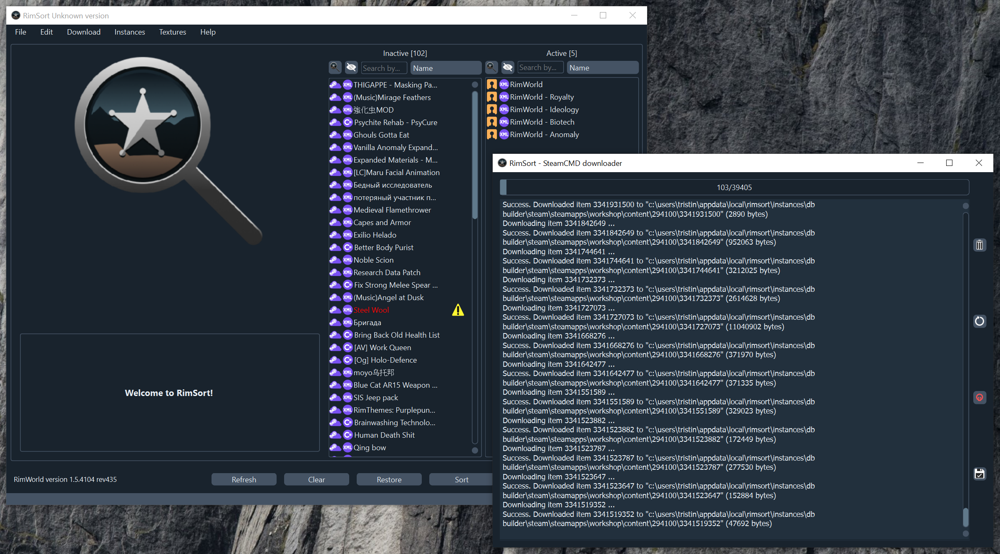

    <h1 align="center">RimDex</h1>
    
A free and open source multi-platform mod manager for the video game RimWorld. 
    Built from the ground up to be reliable and community managed. 
    Includes support for Linux, Mac, and Windows.

    
<strong><a href="https://github.com/RimDex/RimDex/releases">Releases</a> | <a href="https://rimdex.github.io/RimDex/">Wiki</a> | <a href="https://discord.gg/aV7g69JmR2">Discord</a></strong> 

    

        
    

       

## Installation

To install RimDex, visit the [Releases][Releases] page and download the latest zipped release for your operating system.

For Windows and Linux, unzip the download and run the `RimDex` executable inside the unzipped folder.

For macOS, make sure you grab the appropriate release per your CPU (i386 is for an Intel CPU Mac, ARM is for an Apple M1/M2 CPU Mac). You may need to follow [special instructions](https://rimdex.github.io/RimDex/user-guide/downloading-and-installing#macos) to get around Gatekeeper errors.

Check the [wiki][Wiki] for more detailed instructions.

## Contributing

Bugs and feature requests are tracked in the [Issues][Issues] section of this repo. If you run into a bug or have a feature suggestion, feel free to create an Issue here yourself!

See the [wiki][Wiki] for detailed instructions on building RimDex yourself as well as guidelines for making pull requests.

Interested in helping translate RimDex to your language? Check out our [Translation Guidelines](https://rimdex.github.io/RimDex/development-guide/translation-guidelines) for detailed instructions on how to contribute translations.

## FAQ and Issues

If you have an issue, make sure you **checked the [wiki][Wiki]** for a solution.

[][Discord]

[Wiki]: https://rimdex.github.io/RimDex/
[Issues]: https://github.com/RimDex/RimDex/issues
[Releases]: https://github.com/RimDex/RimDex/releases
[Discord]: https://discord.gg/aV7g69JmR2
